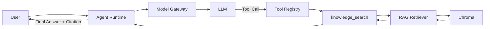

# Hengguang AI Platform Demo

面向「湖南恒光科技股份有限公司 AI 平台工程师」岗位的 3–5 天求职技术 Demo：
一个可运行、可演示、可 Docker 部署的最小企业 AI 平台原型，覆盖 Model Gateway、RAG、Agent、
RBAC、审计与监控。

**声明**：本项目仅用于技术演示和求职交流。知识库只用公开资料，ERP / 安全 / 设备数据全部为
合成数据（synthetic data），不接入恒光内部系统，不使用任何内部数据、账号或密钥。

## 这是什么 / 为什么做

- 模拟化工制造企业在已有 OA/ERP/DCS 基础上引入统一 AI 能力层。
- 重点不是聊天机器人，而是验证「模型 + 知识 + 业务系统 + Agent」能否形成一个统一 AI 平台。

## 架构

```text
Web UI -> FastAPI
            |  /api/chat     -> Model Gateway（直连，Day 1）
            |  /api/agent/run -> Agent Runtime（Day 3）
            |                     |  Model Gateway -> LLM（mock / OpenAI-compatible）
            |                     |  Tool Registry -> knowledge_search -> RAG (Chroma)
            |                     |                 -> document_lookup
            |                     v
            |              Answer + Sources + Trace
            v
     Audit Log / Metrics（Day 4）
```



详见 [ARCHITECTURE.md](./ARCHITECTURE.md) 与 [SPEC.md](./SPEC.md)。

## 当前状态

✅ **Day 1 完成**：Model Gateway + MockProvider + `/api/chat` + pytest 全通过

- Model Gateway 抽象层（`app/gateway/`）
- MockProvider 无需 API Key 即可运行
- OpenAI-compatible Provider 预留扩展（DeepSeek/Qwen/Ollama）
- `/health`、`/api/models`、`/api/chat` 三个核心端点

✅ **Day 2 完成**：RAG 知识库（ingest → chunk → embedding → Chroma → 检索 → citation）

- 文档提取（`app/rag/extractor.py`）：Markdown / TXT / PDF（pypdf 按页提取）
- Markdown 感知 chunker（`app/rag/chunker.py`）：按 heading 切分，800–1200 字、
  overlap 100–200，超长章节按句子边界滑窗
- 可替换 EmbeddingProvider（`app/embeddings/`）：默认离线 mock（hash n-gram，无需 API Key），
  可切 OpenAI-compatible `/embeddings`
- Chroma 持久化向量库（`app/rag/store.py`），混合检索（向量 + 词面重合，`app/rag/retriever.py`）
- RAG 回答（`app/rag/pipeline.py`）：召回 → 编号 context → Model Gateway 生成带 `[n]` 引用的回答，
  找不到依据时明确说明「知识库没有足够信息」
- `/api/knowledge/ingest`、`/api/knowledge/documents`、`/api/knowledge/search`
- 知识库只含公开资料（公司公开简介、2025 年报、2026 半年报、产品/产能、公开新闻），
  每篇文档带 document_id / title / source / url / published_at metadata

✅ **Day 3 完成**：Agent Workflow + Tool Calling + Agent Loop

- Tool 抽象（`app/agent/tools/base.py`）：Tool 协议 + ToolResult，JSON Schema 由
  pydantic args model 生成（单一事实来源），参数校验失败不会执行工具
- Tool Registry（`app/agent/registry.py`）：白名单注册，重名/未知工具明确报错
- Tool Executor（`app/agent/executor.py`）：validate → lookup → execute → ToolResult，
  工具异常转换为受控 failure，不向 API 暴露 Python 异常
- 两个业务 Tool：`knowledge_search`（封装 Day 2 RAG 检索，citation 一路保留）、
  `document_lookup`（按 document_id 查询文档业务信息）
- Agent Runtime（`app/agent/runtime.py`）：AgentState / Agent Loop / execution trace，
  `max_steps` + `max_tool_calls` 安全限制，永不无限循环
- Model 扩展：`ModelResponse.tool_calls` + `ToolCall`；MockProvider 支持 deterministic
  tool calling（零 API Key 全流程可跑）；OpenAI-compatible provider 支持发送 tools、解析 tool_calls
- Prompt policy（`app/agent/prompts.py`）：优先知识库、不编造、无依据时明确说明、引用来源
- `POST /api/agent/run`：独立 Agent API（与 `/api/chat` 分离）
- 单元/集成测试 139 个全部通过（零 API Key、零外网）

按 SPEC 第 14 节的 5 天计划逐步实现：Day 1 Platform Skeleton → Day 5 UI + Packaging。

## Quick Start

```bash
# Backend (default: mock providers, no API key needed)
uv sync
uv run uvicorn app.main:app --reload   # http://localhost:8000

# Tests
uv run pytest

# Frontend
cd web && npm install && npm run dev    # http://localhost:5173 (dev)

# Docker
cp .env.example .env
docker compose up -d                    # API :8000, Web :3000
```

首次启动后需要把公开资料导入知识库（写入 `CHROMA_PATH`）：

```bash
curl -X POST http://localhost:8000/api/knowledge/ingest -H 'Content-Type: application/json' -d '{}'
# {"documents":6,"chunks":45,"status":"completed"}
```

## Day 3 — Agent Workflow

两个清晰入口：

```text
/api/chat       Direct Chat
                     ↓
                Model Gateway

/api/agent/run  Agent
                     ↓
                Model Gateway
                     ↓
                Tool Registry
                     ↓
                Knowledge Search
                     ↓
                RAG
                     ↓
                Citation
```

Agent Loop：

```text
Step 1  LLM → knowledge_search
Step 2  knowledge_search → 5 chunks（citation 保留）
Step 3  LLM → final answer + sources
```

```bash
# 企业知识问答（默认 Mock Provider 即可完成演示，无需 API Key）
curl -X POST http://localhost:8000/api/agent/run \
  -H 'Content-Type: application/json' \
  -d '{
    "message": "恒光主要有哪些业务？"
  }'
# {"request_id":"req_xxx","answer":"根据知识库检索到的 5 条资料...\n[1] ...","model":"mock-model",
#  "provider":"mock","steps":2,"status":"completed",
#  "tool_calls":[{"name":"knowledge_search","arguments":{"query":"恒光主要有哪些业务？"},"success":true,"error":null}],
#  "sources":[{"index":1,"document_id":"hengguang-public-profile","title":"湖南恒光科技股份有限公司公开简介",
#              "section":"主营业务","source":"public","citation":"湖南恒光... · 主营业务"}],
#  "trace":[{"step":1,"type":"llm","tool":"knowledge_search"},{"step":1,"type":"tool_call","tool":"knowledge_search","detail":"5 chunks"},
#           {"step":2,"type":"llm"},{"step":2,"type":"final"}]}

# 普通对话（不调用 Tool）
curl -X POST http://localhost:8000/api/agent/run \
  -H 'Content-Type: application/json' \
  -d '{
    "message": "你好"
  }'
# {"request_id":"req_xxx","answer":"你好！我是恒光 AI 平台的模拟助手...","steps":1,"tool_calls":[],"sources":[]}

# 文档查询
curl -X POST http://localhost:8000/api/agent/run \
  -H 'Content-Type: application/json' \
  -d '{"message": "查看恒光2025年年报的详细信息"}'
```

安全限制：`AGENT_MAX_STEPS`（默认 5）限制 LLM 轮数，`AGENT_MAX_TOOL_CALLS`（默认 8）
限制工具执行次数；达到上限安全停止并在响应 `status` 中标注，模型持续请求同一个 Tool
也会最终终止。未知工具、malformed 参数不会执行，工具异常转换为受控失败返回给 Agent。

## API 示例

```bash
# 健康检查
curl http://localhost:8000/health
# {"status":"ok","version":"0.1.0"}

# 模型列表
curl http://localhost:8000/api/models
# {"models":[{"provider":"mock","model":"mock-model","enabled":true}]}

# 聊天（直连 Model Gateway，Day 1 行为不变）
curl -X POST http://localhost:8000/api/chat \
  -H 'Content-Type: application/json' \
  -d '{"message": "你好"}'
# {"request_id":"req_xxx","answer":"你好！我是恒光 AI 平台的模拟助手...","mode":"auto","model":"mock-model","provider":"mock","latency_ms":0}

# Agent 运行（Tool Calling，见上文 Day 3 章节）
curl -X POST http://localhost:8000/api/agent/run \
  -H 'Content-Type: application/json' \
  -d '{"message": "恒光主要有哪些业务？"}'

# 知识库 ingest（首次启动后执行一次；RBAC（admin）在 Day 4 接入）
curl -X POST http://localhost:8000/api/knowledge/ingest \
  -H 'Content-Type: application/json' -d '{"path": "data/documents"}'
# {"documents":6,"chunks":45,"status":"completed","skipped":[],"errors":[]}

# 知识库文档列表 + chunk 统计
curl http://localhost:8000/api/knowledge/documents

# 知识库检索：Top-K chunks + metadata + citation + 带引用的回答
curl -X POST http://localhost:8000/api/knowledge/search \
  -H 'Content-Type: application/json' \
  -d '{"query": "恒光主要有哪些业务？", "top_k": 3}'
# {"query":"...","count":3,
#  "results":[{"document_id":"hengguang-public-profile","title":"湖南恒光科技股份有限公司公开简介",
#              "section":"主营业务","content":"## 主营业务 ...","score":0.24,"citation":"... · 主营业务"}],
#  "citations":[{"index":1,"document_id":"...","title":"...","section":"主营业务"}],
#  "answer":"根据知识库检索到的 3 条资料... [1]","model":"mock-model","provider":"mock","latency_ms":3}
```

## Demo Scenarios

| 场景 | 输入 | 走通 | 状态 |
|---|---|---|---|
| 企业知识问答 | 恒光主要有哪些业务？ | `/api/agent/run` → knowledge_search → RAG → citation | ✅ Day 3 |
| 普通对话 | 你好 | `/api/agent/run` → LLM → final answer（不查知识库） | ✅ Day 3 |
| 无依据问题 | 恒光内部某员工今天几点下班？ | knowledge_search → 无依据 → 明确说明「没有足够信息」 | ✅ Day 3 |
| Tool Failure | Chroma unavailable | ToolResult.success=false → 受控错误，不 500 | ✅ Day 3 |
| 文档查询 | 查看恒光2025年年报的详细信息 | document_lookup | ✅ Day 3 |
| RAG 检索（直连） | 恒光主要有哪些业务？ | `POST /api/knowledge/search` | ✅ Day 2 |
| ERP 分析 | 最近30天原材料采购价格有什么变化？ | erp_purchase_analysis | Day 4+ |
| 安全分析 | 最近一个月哪个区域安全问题最多？ | safety_incident_analysis | Day 4+ |

## 数据边界

- 公开数据：`data/documents/`（公开公司简介、公开年报/新闻）
- 合成数据：`data/synthetic/`（ERP 采购、安全事件、设备维护）
- 不接入真实 ERP/OA/DCS，不做真实生产控制。

## 运行环境要求

- Python 3.11+（uv 管理）
- Node.js 18+（前端）
- Docker / Docker Compose（可选部署）
