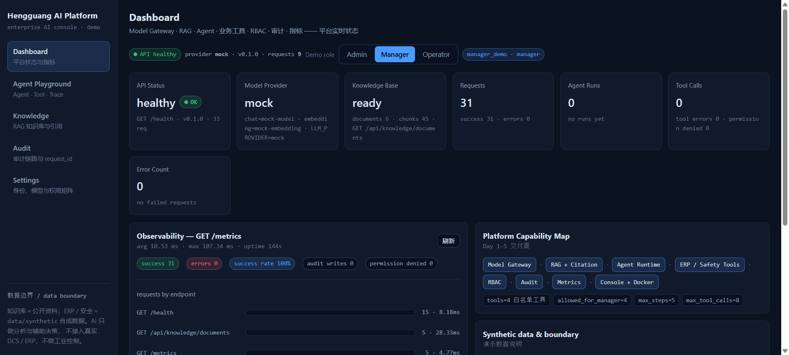
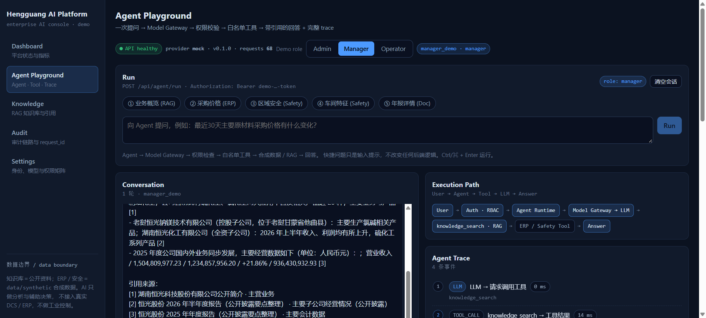
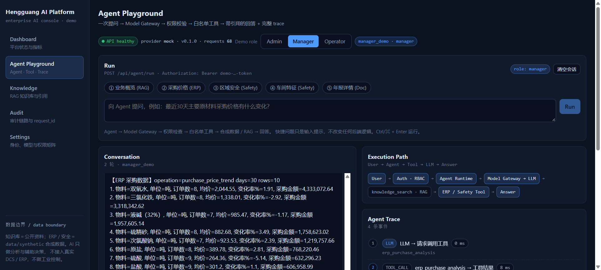
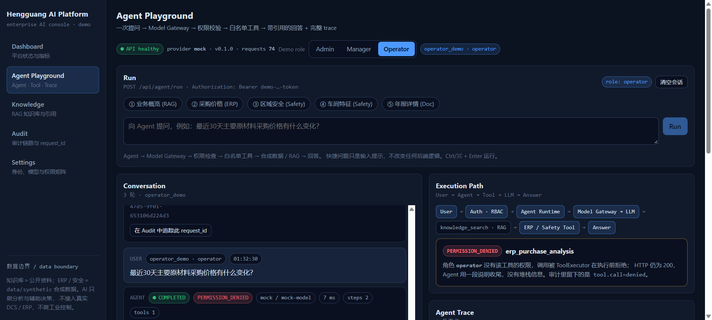
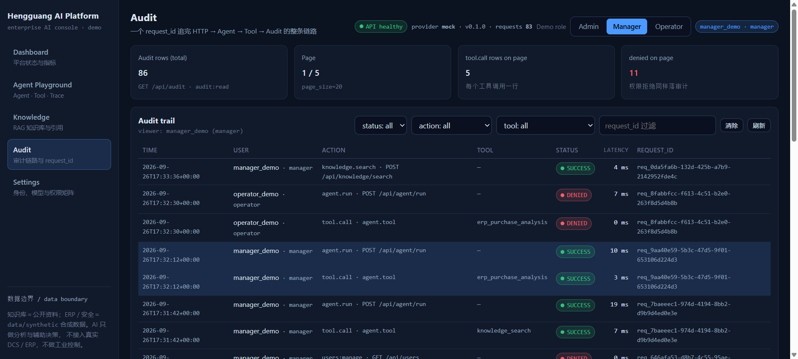
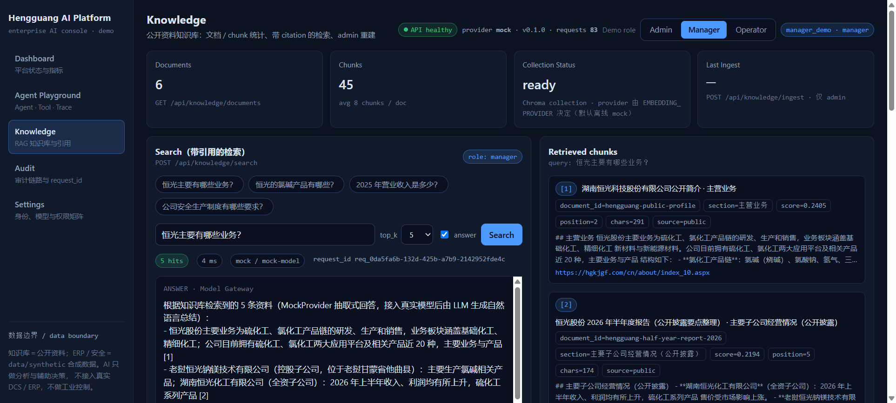

# Hengguang AI Platform Demo

> 面向「湖南恒光科技股份有限公司 · AI 平台工程师」岗位的求职技术 Demo：
> 一个 **可运行、可演示、可 Docker 部署** 的最小企业 AI 平台原型。
> 5 天迭代：Model Gateway → RAG → Agent → 企业业务工具 + RBAC + 审计 + 指标 → Web Console。

**Model Gateway · RAG · Agent · ERP Tool · Safety Tool · RBAC · Audit · Metrics · Docker Compose · Web Console**

它不是一个聊天机器人，而是验证一件事：**模型、知识、业务系统、Agent 能否被收敛进同一个 AI 平台层**，
并且在这一层里把权限、审计、可观测性、失败处理都做对。

> **声明 / Disclaimer**
> This project is an interview-oriented prototype. 它只使用：公开企业资料、合成（synthetic）企业数据、公开演示凭据。
> 它**不**连接恒光内部系统、**不**使用任何内部数据、**不**访问真实 ERP / OA / DCS、**不**控制任何工业设备。
> **AI 在本项目里只用于分析与辅助决策（analysis & decision support），不做工业控制（not direct industrial control）。**

| | |
|---|---|
| 后端 | FastAPI + uv + Pydantic v2 + SQLAlchemy 2 + Chroma（默认全 mock provider，零 API Key、零外网即可跑通） |
| 前端 | React 18 + Vite 6 + TypeScript（无 UI 框架、无图表库，控制台风格；5 个页面全走真实 API） |
| 测试 | `423 passed`（Day 1–3 的 139 个原始测试全部保留，未删弱；代码基线 `460a6ee` 时为 420） |
| 代码检查 | `ruff check` PASS · `ruff format --check` PASS · `tsc -b && vite build` PASS |
| 部署 | `docker compose up --build` → API `:8000` + Web Console `:3000`（nginx 反代，重启数据持久） |

## Screenshots

| Dashboard（平台状态 / 指标 / 端点延迟） | Agent Playground（RAG 回答 + trace + 工具 + 引用） |
|---|---|
|  |  |

| ERP Tool（manager 成功） | 权限边界（operator → PERMISSION_DENIED，受控不崩） |
|---|---|
|  |  |

| Audit 链路（一个 request_id 追到底） | Knowledge（带 citation 的 RAG 检索） |
|---|---|
|  |  |

## 为什么做这个项目

化工制造企业的现实约束是：模型能力可以用，但**企业内部数据、权限、审计、失败处理**才是能不能上线的门槛。
所以这个 Demo 把重点放在平台层，而不是 prompt 层：

| 企业真实问题 | 本项目的答案 | 位置 |
|---|---|---|
| 模型供应商会换、要能统一切换与降级 | Model Gateway 抽象，业务代码不 import provider SDK；mock / OpenAI-compatible 可切换；降级**默认关闭**（`LLM_FALLBACK=false`），开启后响应打 `degraded=true` 标 | `app/gateway/` |
| 模型不能凭记忆回答企业事实 | RAG：公开资料 ingest → heading 感知 chunk → Chroma → top-k + `[n]` 引用；无依据时明确说「没有足够信息」 | `app/rag/` |
| 让模型查业务系统，但不能让它写 SQL | 白名单 Tool + 固定 operation + 参数化查询；LLM 无法传表名 / 列名 / SQL | `app/agent/tools/`, `app/db/queries.py` |
| 谁能用哪个工具 | RBAC：路由权限 + **工具级权限**（在 `ToolExecutor` 内二次执行），越权 → 受控 `PERMISSION_DENIED`，HTTP 仍是 200、Agent 不崩 | `app/auth/permissions.py` |
| 出事要能复盘 | 每次请求生成 `request_id`，同一 ID 贯穿 HTTP / Agent / Tool / 审计；`GET /api/audit/{request_id}` 一条链 | `app/observability/` |
| 平台自身要健康 | 指标计数（请求 / 工具 / Agent / 拒绝 / 延迟）+ JSON 结构化日志 + 统一错误信封 | `GET /metrics` |

## 当前状态（Day 1 → Day 5 全部完成）

- [x] **Day 1 模型网关**：Gateway 抽象 + MockProvider + `/api/chat`，无需 API Key
- [x] **Day 2 RAG 知识库**：`data/documents/` → chunker（heading 感知）→ embeddings → Chroma → top-k + citation，带引用的回答；无依据时明确回答「没有足够信息」
- [x] **Day 3 Agent 工作流**：`/api/agent/run` 跑 `knowledge_search` → RAG → 最终回答 + sources；`document_lookup` 查文档元数据；LLM 决定调不调工具；trace 可视化全部步骤；`max_steps` / `max_tool_calls` 安全限制；工具失败不 500
- [x] **Day 4 平台化 + 业务工具**：合成 ERP 采购/库存分析 + 安全事件分析 Tool；RBAC（路由级 + 工具级，越权在 Tool 边界受控拒绝）；审计轨迹（一个 request_id 追到底）；指标 / 结构化日志；统一错误结构
- [x] **Day 5 产品化**：Web Console（Dashboard / Agent Playground / Knowledge / Audit / Settings，角色切换 UI，RBAC 边界可见，trace 可视化，真实 API 数据，指标面板）；Docker 最终验证（API + Web，重启数据持久）；真实 LLM provider 冒烟；README / ARCHITECTURE / DEMO_SCRIPT 定稿

> 测试基线（历史轨迹，数字对应各自完成时点）：Day 1–3 `139 passed` → Day 4 后 `380 passed` → Day 5 后 `410 passed`
> → Audit Fix（`460a6ee`）后 `420 passed` → 当前（一致性修复 + `AuditLog.clear()` 回归测试）`422 passed` → 本轮实机调试（拒绝审计 action 归一 + 网关 5xx 识别）`423 passed`。
> 所有 Day 1–5 测试未删除、未弱化；Day 5 新增 30 个 Web Console 契约测试，本次新增 2 个审计内存上界回归测试。

> **基线口径**：本文档中 `460a6ee` 指**代码证据基线**（Day 1–5 + Audit Fix）。本轮之后的提交只改文档与两处代码一致性缺陷，不改变架构结论。

## 架构

```text
Web Console (nginx :3000, React SPA)
   │ 静态资源 + 反代 /api /health /metrics
   ▼
Model Gateway ◀── Knowledge/RAG ◀── Agent Runtime ──▶ ERP Tool / Safety Tool / Knowledge Tool
      │              │                     │               │
   provider      SQLite+Chroma          request_id       SQLite (synthetic)
   (mock / OpenAI)   ▲                  贯穿审计/指标      ▲
                     │                        │             │
                     └──── data/documents ────┘── data/synthetic ──┘
```

完整说明、调用链、失败边界与 Day 5 前后端交互见 [ARCHITECTURE.md](./ARCHITECTURE.md)。

## Quick Start

后端（需要 `uv`，零 API Key）：

```bash
cd hengguang-ai-platform-demo
uv sync --frozen

# 方式 1：直接跑
uv run uvicorn app.main:app --port 8000

# 方式 2：Docker
docker compose up --build          # API :8000，Web Console :3000
```

Web Console 开发模式（可选，热更新）：

```bash
cd web
npm install
npm run dev                        # http://localhost:5173（默认代理到 :8000，可用 VITE_API_PROXY_TARGET 覆盖）
```

生产构建 / 验证前端：

```bash
cd web
npm run build                      # 先 `tsc -b`（类型检查）再 `vite build`
```

### API / Web 冒烟（后端先启动）

```bash
curl http://localhost:8000/health
curl -s http://localhost:8000/metrics | head -c 200; echo
curl -s -H "Authorization: Bearer demo-admin-token" \
     -X POST http://localhost:8000/api/agent/run \
     -H 'Content-Type: application/json' -d '{"message":"恒光主要有哪些业务？"}'
curl -s -H "Authorization: Bearer demo-admin-token" "http://localhost:8000/api/audit?page_size=5"
```

Web Console 打开 `http://localhost:3000`（Docker）或 `:5173`（dev）。

## 演示账号（RBAC）

三个演示角色（token 故意公开，用于面试零门槛演示；生产应换成真实身份提供方）：

| 角色 | Token | 能做什么 | 不能做什么 |
|---|---|---|---|
| admin | `demo-admin-token` | 全部：知识库 ingest、ERP/Safety 工具、审计、用户管理 | — |
| manager | `demo-manager-token` | RAG、ERP 采购分析、安全事件分析、审计、模型列表 | 不能 ingest、不能管用户 |
| operator | `demo-operator-token` | RAG 知识问答、安全事件分析、直接聊天 | 不能查 ERP（`tool:erp` 拒绝）、不能看审计、不能 ingest |

Web Console 右上角可一键切换这三个角色，立刻看到同一条 ERP 问题在 operator 下被工具边界拒绝、
在 manager 下成功的对比。

## Docker Compose 最终验证

```bash
docker compose up --build
curl http://localhost:8000/health                 # API
curl http://localhost:3000/                       # Web Console (nginx)
curl http://localhost:3000/metrics                # 反代后的指标
```

验证清单（已通过）：

- `docker compose config` 解析通过（`.env` 可选，`required: false`）
- 两个服务 build + start；API 带 `service_healthy` 依赖，web 不再因启动顺序 502
- 反代 `/api` `/health` `/metrics` 全部 200；静态首页 200
- `docker compose stop && docker compose up -d` 后：SQLite 审计行数、Chroma 文档/chunk 数、
  旧 request_id 的审计轨迹**全部还在**（`./data/runtime` 卷持久）
- 运行中调用 `/api/agent/run`、`/metrics`、`/api/audit`、`/api/knowledge/ingest` 均正常

## 真实 LLM Provider 配置（可选）

默认 `LLM_PROVIDER=mock`（零 Key、零外网）。接真实 provider 只用改环境变量，不改代码：

```bash
export LLM_PROVIDER=openai-compatible
export LLM_BASE_URL=https://api-inference.modelscope.cn/v1   # 任意 OpenAI-compatible /v1
export LLM_API_KEY=<你的 key>
export LLM_MODEL=deepseek-ai/DeepSeek-V4-Flash-0731         # 该端点上可用的模型
# embedding 可保持 EMBEDDING_PROVIDER=mock，RAG 检索不受影响
```

已做真实 provider 冒烟（`ModelScope DeepSeek-V4-Flash`，embedding 仍 mock）：
`POST /api/chat` 直接真实模型回答；`POST /api/agent/run` 走完 RAG 工具链，answer 为真实模型生成、
`model != mock` 且仍保留 5 条带 citation 的 sources。**key 只留在 shell / `.env`（已 gitignore），仓库无任何密钥。**

## Local Real Embedding（本地真实 embedding 开发模式）

上面 Docker 部署的向量层是 mock（零依赖、CI 可跑）。要在本机验证真实检索效果，用
`experiment/local-qwen3-embedding` 分支提供的入口：同一套 `app/` / `web/` / `tests/`，只把 embedding
指向本机 Ollama 的 Qwen3-Embedding-0.6B。

| | main（默认 Docker） | 本地真实模式 |
| --- | --- | --- |
| 启动 | `docker compose up --build -d` | `./scripts/run-local-real-embedding.sh` |
| LLM | 按 `.env`（可接 ModelScope） | ModelScope `Qwen/Qwen3.8-Flash-Next` |
| Embedding | `mock` | Ollama `qwen3-embedding:0.6b`（1024 维） |
| 向量库 | `data/runtime/chroma` · `hengguang_knowledge` | `data/local-real-embedding/chroma` · `hengguang_knowledge_qwen3` |
| SQLite | `data/runtime/app.db` | `data/local-real-embedding/app.db` |
| `RAG_MIN_SCORE` | 0.15 | 0.15 |
| 端口 | API `8000` / Web `3000` | API `127.0.0.1:8001`（不动 Docker 栈） |
| Web 入口 | nginx `:3000`（反代容器内 `api:8000`） | `npm run dev:local` → `:5173`（Vite proxy → `:8001`） |

```bash
ollama pull qwen3-embedding:0.6b          # 约 639 MB，一次性
cp .env.local.example .env.local          # 可选，脚本内置同一套默认值
./scripts/run-local-real-embedding.sh     # 探测 Ollama / 模型 / 维度 → 起 :8001 → 首次自动 ingest

# 用本地 Web Console 驱动这个实例（同源 dev proxy，不需要 CORS）
cd web && npm run dev:local             # 等价于 VITE_API_PROXY_TARGET=http://127.0.0.1:8001 npm run dev
```

脚本自带隔离守护：`CHROMA_PATH` 落到 `data/runtime/chroma`、`DATABASE_URL` 落到 `data/runtime/app.db`、
`CHROMA_COLLECTION=hengguang_knowledge` 或 `EMBEDDING_PROVIDER=mock` 都会直接拒绝启动；key 只从环境变量或
交互输入取用，**绝不打印**；`data/local-real-embedding/` 与 `.env.local` 已 gitignore。仓库根目录的 `.env`
（Docker 用）不会被读取修改，`docker-compose.yml` 也不涉及。

本地 A/B 实测（同一份 6 篇文档 / 45 chunk，只换 embedding，其余配置一致）：域内查询 top1 融合分从 mock 的
0.24–0.59 升到 0.34–0.74，物料/产品表格块从第 2–5 位升到第 1 位；无关问题在两种模式下都拿不到有效证据。
这是小样本演示级测量，**不是生产 benchmark**。换真实向量后融合分尺度整体抬高，所以 mock 下几乎不起作用的
0.10 阈值在真实模式下会漏进无关结果：实测干净带为 `(0.1146, 0.1861]`（域外最高 0.1146 / 域内次位最低 0.1861），
取 **0.15**。该数值只属于对应的那一个 collection，换 embedding 模型必须重新标定。

限制（本分支已知边界，不夸大）：

- Web Console 连本地真实实例用 **Vite dev proxy**：`web/vite.config.ts` 的代理目标取自
  `VITE_API_PROXY_TARGET`（默认 `http://127.0.0.1:8000`，Docker/main 行为不变）。浏览器始终请求同源
  `:5173`，由 dev server 转发到 `:8001`，**因此不需要给后端加 CORS**，也不改 nginx 生产配置。
  `:3000` 那个容器 Console 的反代上游是容器 DNS `api:8000`，它仍然只走 Docker 默认（mock）路径。
- `/api/*` 目前没有声明 OpenAPI `securitySchemes`，所以 `:8001/docs`（Swagger）无法代填 Bearer，
  鉴权端点在 Swagger 里会返回 401；带 token 的验证请用 `npm run dev:local` 的 Web Console 或 curl。
- 不同 provider 的向量空间互不兼容：切换 embedding 必须同时换 `CHROMA_PATH` + `CHROMA_COLLECTION` 并重新
  ingest，不能往已有 collection 里混写（实测两套向量互比余弦 ≈ 0）。
- 未做 Instruct 前缀、reranker、query rewrite。

## 数据边界（合成数据声明）

- `data/documents/`：公开公司简介、公开年报/新闻摘要 → RAG 知识库（真实来源：公开资料）
- `data/synthetic/`：`schema.sql` + `seed.json` → 9 张表 SQLite（供应商 / 物料 / 采购订单 / 库存 / 安全事件 / 设备维修…），
  **全部人工构造、可复现，与恒光股份真实经营数据无关**，详见 `data/synthetic/README.md`
- `data/runtime/`：运行产物（`app.db` + Chroma），已 gitignore，不提交 Git

## 安全说明（Security Notes）

- **权限在 Tool 边界二次执行**：路由层校验一次，`ToolExecutor` 再校验一次；operator 调 ERP 工具 →
  `success=false, error_code=PERMISSION_DENIED`，Agent 正常收尾、HTTP 200，不 500、不崩、不泄数据
- **统一错误信封**：401/403/404/409/422/500 都返回 `{ detail, request_id, error:{ code, message, details } }`，
  前端直接渲染，**不显示 stack trace**
- **演示 token 是常量**（`demo-*-token`），仅用于面试演示；生产需换成 JWT/SSO，但 `Permission`/角色矩阵/工具边界可原样保留
- **无 JWT / 无登录态**：鉴权只认固定 Bearer 常量；`data/runtime` 不入库、不含凭据
- Web 角色切换只是前端切换 Authorization header，**后端仍按 token 做权威校验**——切换 operator 立刻看到 403

## 已知限制 / 边界（诚实说明）

- 身份是三个固定 token，不是 JWT/SSO/OAuth（Day 4 明确声明）
- 业务数据是合成 SQLite，不是真 ERP/OA/DCS；AI 不做工业控制
- 默认 mock provider；真实 LLM 需自备 Key（配置方式见上），embedding 冒烟仍走 mock
- `LLM_FALLBACK` 默认 **false**：provider 失败就返回受控 502 `PROVIDER_ERROR`，**不静默换成 mock**。显式开启后才会回落，且在网关层打 `degraded=true` 标（该标记目前不上 HTTP 响应字段，可靠审计行的 `model_name` 与 warning 日志识别）
- 知识库 ingest 目前全量重建（不增量）；Chroma 为本地嵌入式，未做多副本/集群
- Web Console 角色切换是 demo UX，不是真正的多用户登录（后端仍按 token 鉴权）
- 指标是进程内计数，重启即清零（审计/知识库数据持久在 SQLite/Chroma，不受影响）；审计的进程内副本是有界 `deque`（`AUDIT_MEMORY_MAX_RECORDS`，默认 1000 条），只用于测试与调试可见性，权威记录始终在 `audit_logs` 表

## 面试讲解要点（Interview Talking Points）

完整面试题库与逐题标准答案（含「我的项目证据」「高危追问」「开源组件评估」「反问环节」）：

- [`docs/interview/HENGGUANG_INTERVIEW_GUIDE.md`](docs/interview/HENGGUANG_INTERVIEW_GUIDE.md) — Markdown 全文
- [`docs/interview/index.html`](docs/interview/index.html) — 自包含离线复习台（浏览器直接打开，可搜索 / 按标签过滤）

1. **为什么做平台层而不是 prompt 层**：化工企业真正难的是数据/权限/审计/失败处理，不是把模型接上。
2. **Model Gateway 抽象**：业务不 import provider SDK，换供应商改配置即可；默认 provider 失败就报错，**不静默换成 mock**——只有显式 `LLM_FALLBACK=true` 才降级，且降级响应带 `degraded=true`，调用方能区分「模型说的」和「兜底说的」。
3. **RAG 的 heading 感知分块**：保留标题上下文进 chunk，让引用（`[n]` + section）准确、可追溯。
4. **Agent 的「白名单工具 + 固定 operation + 参数化 SQL」**：让 LLM 查业务系统，但它写不了 SQL。
5. **RBAC 在 Tool 边界二次执行**：这是企业最关心的「越权调工具怎么办」——受控拒绝、审计留痕、Agent 不崩。
6. **request_id 贯穿**：一次请求在 HTTP / Agent / Tool / 审计四处用同一 ID，出事能追到底。
7. **指标 + 结构化日志 + 统一错误信封**：平台可观测、可排障。
8. **测试策略**：mock provider + 合成数据保证 `423` 个测试离线、可复现、零外部依赖。

## 项目结构

```text
app/
  api/        路由：chat / agent / knowledge / models / users / audit / metrics / health
  gateway/    Model Gateway + Mock/OpenAI-compatible provider
  rag/        chunker / extractor / ingest / retriever / citation / prompt / store
  agent/      AgentRuntime + ToolRegistry + tools (knowledge/document/erp/safety)
  db/         合成 SQLite 初始化 + 参数化查询（operation 白名单）
  auth/       权限定义 + 角色矩阵 + Bearer 鉴权（`permissions.py` / `auth.py` / `dependencies.py`）
  embeddings/ Mock + OpenAI-compatible embedding provider
  services/   用例编排（knowledge / agent）
  observability/ request_id / 审计 / 指标 / 结构化日志 / 错误信封
  main.py     FastAPI app 装配（CORS、中间件、启动初始化）
data/
  documents/  公开资料（RAG 语料）      synthetic/ 合成 ERP/安全 schema+seed
  runtime/    运行产物（app.db + chroma，gitignore）
web/          React Console（src 下 app/pages/components/services/hooks/types）
tests/        Day 1–5 全部测试（423）
docs/         interview/ 面试题库（Markdown 为唯一正本 + 自包含离线 HTML）
```

## 测试 / 质量

```bash
uv run pytest -q            # 423 passed
uv run ruff check .         # PASS
uv run ruff format --check .# PASS
cd web && npx tsc -b && npm run build   # 前端类型检查 + 产物
```

Day 5 契约测试在 `tests/integration/test_web_console_contract.py`：钉死 Web Console 依赖的每个 API 字段
（agent 的 `tool_calls/trace/sources`、knowledge 的 `documents/results/citations/ingest`、audit 的
`items/total/request_id/viewer`、metrics 的固定字段、operator 403 on `/api/models` 与 `/api/audit`、
`PERMISSION_DENIED` 不出现 stack trace 等），保证后端字段漂移不会悄悄打断前端。
