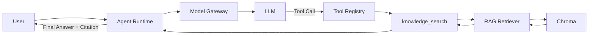

# Hengguang AI Platform Demo

面向「湖南恒光科技股份有限公司 AI 平台工程师」岗位的 3–5 天求职技术 Demo：
一个可运行、可演示、可 Docker 部署的最小企业 AI 平台原型，覆盖 Model Gateway、RAG、Agent、
RBAC、审计与监控。

**声明**：本项目仅用于技术演示和求职交流。知识库只用公开资料，ERP / 安全 / 设备数据全部为
合成数据（synthetic data），不接入恒光内部系统，不使用任何内部数据、账号或密钥。

## 这是什么 / 为什么做

- 模拟化工制造企业在已有 OA/ERP/DCS 基础上引入统一 AI 能力层。
- 重点不是聊天机器人，而是验证「模型 + 知识 + 业务系统 + Agent」能否形成一个统一 AI 平台。

## 架构

```text
Web UI -> FastAPI
            |  Auth middleware（request_id / 计时 / 指标，Day 4）
            |  Bearer Token RBAC（admin / manager / operator，Day 4）
            |  /api/chat       -> Model Gateway（直连，Day 1）
            |  /api/agent/run  -> Agent Runtime（Day 3）
            |                     |  Model Gateway -> LLM（mock / OpenAI-compatible）
            |                     |  Tool Registry -> knowledge_search -> RAG (Chroma)
            |                     |                 -> document_lookup
            |                     |                 -> erp_purchase_analysis  -> SQLite（合成 ERP，Day 4）
            |                     |                 -> safety_incident_analysis-> SQLite（合成安全，Day 4）
            |                     v
            |              Answer + Sources + Trace（tool 级权限在 executor 内执行）
            v
     Audit Log / Metrics / Structured Log（Day 4）  ->  /api/audit、/metrics
```



详见 [ARCHITECTURE.md](./ARCHITECTURE.md) 与 [SPEC.md](./SPEC.md)。

## 当前状态

✅ **Day 1 完成**：Model Gateway + MockProvider + `/api/chat` + pytest 全通过

- Model Gateway 抽象层（`app/gateway/`）
- MockProvider 无需 API Key 即可运行
- OpenAI-compatible Provider 预留扩展（DeepSeek/Qwen/Ollama）
- `/health`、`/api/models`、`/api/chat` 三个核心端点

✅ **Day 2 完成**：RAG 知识库（ingest → chunk → embedding → Chroma → 检索 → citation）

- 文档提取（`app/rag/extractor.py`）：Markdown / TXT / PDF（pypdf 按页提取）
- Markdown 感知 chunker（`app/rag/chunker.py`）：按 heading 切分，800–1200 字、
  overlap 100–200，超长章节按句子边界滑窗
- 可替换 EmbeddingProvider（`app/embeddings/`）：默认离线 mock（hash n-gram，无需 API Key），
  可切 OpenAI-compatible `/embeddings`
- Chroma 持久化向量库（`app/rag/store.py`），混合检索（向量 + 词面重合，`app/rag/retriever.py`）
- RAG 回答（`app/rag/pipeline.py`）：召回 → 编号 context → Model Gateway 生成带 `[n]` 引用的回答，
  找不到依据时明确说明「知识库没有足够信息」
- `/api/knowledge/ingest`、`/api/knowledge/documents`、`/api/knowledge/search`
- 知识库只含公开资料（公司公开简介、2025 年报、2026 半年报、产品/产能、公开新闻），
  每篇文档带 document_id / title / source / url / published_at metadata

✅ **Day 3 完成**：Agent Workflow + Tool Calling + Agent Loop

- Tool 抽象（`app/agent/tools/base.py`）：Tool 协议 + ToolResult，JSON Schema 由
  pydantic args model 生成（单一事实来源），参数校验失败不会执行工具
- Tool Registry（`app/agent/registry.py`）：白名单注册，重名/未知工具明确报错
- Tool Executor（`app/agent/executor.py`）：validate → lookup → execute → ToolResult，
  工具异常转换为受控 failure，不向 API 暴露 Python 异常
- 两个业务 Tool：`knowledge_search`（封装 Day 2 RAG 检索，citation 一路保留）、
  `document_lookup`（按 document_id 查询文档业务信息）
- Agent Runtime（`app/agent/runtime.py`）：AgentState / Agent Loop / execution trace，
  `max_steps` + `max_tool_calls` 安全限制，永不无限循环
- Model 扩展：`ModelResponse.tool_calls` + `ToolCall`；MockProvider 支持 deterministic
  tool calling（零 API Key 全流程可跑）；OpenAI-compatible provider 支持发送 tools、解析 tool_calls
- Prompt policy（`app/agent/prompts.py`）：优先知识库、不编造、无依据时明确说明、引用来源
- `POST /api/agent/run`：独立 Agent API（与 `/api/chat` 分离）
- 单元/集成测试 139 个全部通过（零 API Key、零外网）

✅ **Day 4 完成**：平台化 —— RBAC、合成业务数据库、业务 Tool、审计、指标、结构化日志、统一错误

- 数据层（`app/db/`）：SQLAlchemy 模型 + SQLite（`data/runtime/app.db`，gitignored）、
  `data/synthetic/schema.sql`（参考 DDL，与 ORM 列级一致，有测试校验）、
  `data/synthetic/seed.json`（静态目录 + 生成参数）
- 确定性播种（`app/db/seed.py`）：`random_seed=20260926`，采购订单/安全事件按「今天」倒推 120 天生成，
  重复执行结果一致、幂等跳过、`--force` 重建；uvicorn 重启不会清空数据
- 固定参数化查询（`app/db/queries.py`）：7 个 ERP + 5 个安全聚合查询，LLM 无法传入 SQL / 表名 / 列名
- RBAC（`app/auth/`）：Bearer Token → 角色 → 权限；3 个固定演示 token（无 JWT / 登录页 / SSO）；
  权限矩阵与路由映射集中定义；401 缺/坏 token，403 权限不足；**Tool 级权限在 `ToolExecutor` 内二次执行**
- 业务 Tool（`app/agent/tools/`）：`erp_purchase_analysis`（7 operation）、
  `safety_incident_analysis`（5 operation）；返回可读文本 + `metadata.payload` 结构化数据；
  失败（未知 operation / 参数非法 / 数据库不可用）均为受控 `ToolResult`，不抛裸异常
- Mock Provider 业务路由：自然语言 → 正确工具 + 正确 operation + 正确时间窗口（无需外网）
- 审计（`app/observability/audit.py`）：`audit_logs` 表记录 API / Agent / Tool 调用
  （request_id、user、endpoint、tool、params、status、latency_ms）；`GET /api/audit` 分页 + 过滤、
  `GET /api/audit/{request_id}` 还原一次运行的完整链路；不记录 API Key / token / 文档全文
- 指标（`app/observability/metrics.py`）：`GET /metrics` 返回 JSON（request_count、success/error、
  avg/max latency、by endpoint、tool_call_count、permission_denied_count、agent_runs_by_status、uptime）
- 结构化日志（`app/observability/logging.py`）：JSON 行，字段含
  timestamp/level/logger/message/request_id/user_id/endpoint/method/status/latency_ms/error_code/event
- 统一错误（`app/api/errors.py`）：`{detail, request_id, error:{code,message,details}}`；
  PlatformError / HTTPException / 校验错误 / 未捕获异常四类 handler，不泄露 traceback 与密钥
- 新增端点：`GET /metrics`、`GET /api/models`（改造）、`GET /api/audit`、`GET /api/audit/{request_id}`、
  `GET /api/users`；所有响应带 `request_id` 与 `X-Request-ID`
- 测试：380 个（Day 1–3 的 139 个全部保留且通过），零 API Key、零外网、CI 可重复

权限矩阵（`app/auth/permissions.py`）：

| 能力 | admin | manager | operator |
|---|:--:|:--:|:--:|
| `GET /health`、`GET /metrics` | ✅ 公开 | ✅ 公开 | ✅ 公开 |
| `POST /api/chat` | ✅ | ✅ | ✅ |
| `GET /api/models` | ✅ | ✅ | ❌ 403 |
| `POST /api/knowledge/search`、`GET /api/knowledge/documents` | ✅ | ✅ | ✅ |
| `POST /api/knowledge/ingest` | ✅ | ❌ 403 | ❌ 403 |
| `POST /api/agent/run` | ✅ | ✅ | ✅ |
| `knowledge_search` / `document_lookup` | ✅ | ✅ | ✅ |
| `safety_incident_analysis` | ✅ | ✅ | ✅ |
| `erp_purchase_analysis` | ✅ | ✅ | ❌ 拒绝（PERMISSION_DENIED） |
| `GET /api/audit`、`GET /api/audit/{id}` | ✅ | ✅ | ❌ 403 |
| `GET /api/users` | ✅ | ❌ | ❌ |

按 SPEC 第 14 节的 5 天计划逐步实现：Day 1 Platform Skeleton → Day 5 UI + Packaging。

## Quick Start

```bash
# Backend (default: mock providers, no API key needed)
uv sync
uv run uvicorn app.main:app --reload   # http://localhost:8000

# Day 4 起 /api/* 需要 Bearer token，先导出三个演示身份（固定常量，见 app/auth/auth.py）
export ADMIN="Authorization: Bearer demo-admin-token"
export MANAGER="Authorization: Bearer demo-manager-token"
export OPERATOR="Authorization: Bearer demo-operator-token"

# 合成业务数据库：首次启动自动建表 + 播种到 ./data/runtime/app.db（gitignored）
# 手工重建：uv run python -m app.db.seed --force
# 重置知识库：删掉 ./data/runtime/chroma 后重新 ingest

# Tests
uv run pytest

# Frontend
cd web && npm install && npm run dev    # http://localhost:5173 (dev)

# Docker
cp .env.example .env
docker compose up -d                    # API :8000, Web :3000
```

首次启动后需要把公开资料导入知识库（写入 `CHROMA_PATH`）：

```bash
curl -X POST http://localhost:8000/api/knowledge/ingest -H 'Content-Type: application/json' -d '{}'
# {"documents":6,"chunks":45,"status":"completed"}
```

## Day 3 — Agent Workflow

> Day 4 起所有 `/api/*` 请求都需要 `Authorization: Bearer <token>`；
> 下面三个 curl 中的 `$ADMIN` 即 `Authorization: Bearer demo-admin-token`。

两个清晰入口：

```text
/api/chat       Direct Chat
                     ↓
                Model Gateway

/api/agent/run  Agent
                     ↓
                Model Gateway
                     ↓
                Tool Registry
                     ↓
                Knowledge Search
                     ↓
                RAG
                     ↓
                Citation
```

Agent Loop：

```text
Step 1  LLM → knowledge_search
Step 2  knowledge_search → 5 chunks（citation 保留）
Step 3  LLM → final answer + sources
```

```bash
# 企业知识问答（默认 Mock Provider 即可完成演示，无需 API Key）
curl -X POST http://localhost:8000/api/agent/run \
  -H "$ADMIN" -H 'Content-Type: application/json' \
  -d '{
    "message": "恒光主要有哪些业务？"
  }'
# {"request_id":"req_xxx","answer":"根据知识库检索到的 5 条资料...\n[1] ...","model":"mock-model",
#  "provider":"mock","steps":2,"status":"completed",
#  "tool_calls":[{"name":"knowledge_search","arguments":{"query":"恒光主要有哪些业务？"},"success":true,"error":null}],
#  "sources":[{"index":1,"document_id":"hengguang-public-profile","title":"湖南恒光科技股份有限公司公开简介",
#              "section":"主营业务","source":"public","citation":"湖南恒光... · 主营业务"}],
#  "trace":[{"step":1,"type":"llm","tool":"knowledge_search"},{"step":1,"type":"tool_call","tool":"knowledge_search","detail":"5 chunks"},
#           {"step":2,"type":"llm"},{"step":2,"type":"final"}]}

# 普通对话（不调用 Tool）
curl -X POST http://localhost:8000/api/agent/run \
  -H "$ADMIN" -H 'Content-Type: application/json' \
  -d '{
    "message": "你好"
  }'
# {"request_id":"req_xxx","answer":"你好！我是恒光 AI 平台的模拟助手...","steps":1,"tool_calls":[],"sources":[]}

# 文档查询
curl -X POST http://localhost:8000/api/agent/run \
  -H "$ADMIN" -H 'Content-Type: application/json' \
  -d '{"message": "查看恒光2025年年报的详细信息"}'
```

安全限制：`AGENT_MAX_STEPS`（默认 5）限制 LLM 轮数，`AGENT_MAX_TOOL_CALLS`（默认 8）
限制工具执行次数；达到上限安全停止并在响应 `status` 中标注，模型持续请求同一个 Tool
也会最终终止。未知工具、malformed 参数不会执行，工具异常转换为受控失败返回给 Agent。

## Day 4 — 业务工具、权限与可观测性

### ERP 采购分析（admin / manager）

```bash
curl -s -X POST http://localhost:8000/api/agent/run \
  -H "$ADMIN" -H 'Content-Type: application/json' \
  -d '{"message": "最近30天主要原材料采购价格如何变化？"}'
```

```json
{"request_id":"req_1f0c…","status":"completed","role":"admin","steps":2,
 "tool_calls":[{"name":"erp_purchase_analysis","arguments":{"operation":"purchase_price_trend","days":30},
   "success":true,"operation":"purchase_price_trend","result_count":10}],
 "answer":"【ERP 采购数据】…\n1. 物料=双氧水, 单位=吨, 订单数=8, 均价=2,044.55, 变化率%=1.91, 采购金额=4,333,072.64\n…"}
```

operation 白名单：`purchase_price_trend` / `top_materials_by_spend` / `supplier_summary` /
`recent_purchase_orders` / `inventory_summary` / `material_consumption` / `purchase_amount_stats`。

### 安全事件分析（全部角色）

```bash
curl -s -X POST http://localhost:8000/api/agent/run \
  -H "$OPERATOR" -H 'Content-Type: application/json' \
  -d '{"message": "最近一个月哪个区域安全问题最多？"}'
# tool_calls[0].name = safety_incident_analysis, operation = incident_by_area
# 1. 区域=A 车间（氯碱）, 事件数=15, 高风险数=3, 未闭环数=3, 占比%=48.39 …
```

### operator 调用 ERP → 权限在 Tool 边界拒绝（HTTP 仍 200，Agent 不崩）

```bash
curl -s -X POST http://localhost:8000/api/agent/run \
  -H "$OPERATOR" -H 'Content-Type: application/json' \
  -d '{"message": "最近30天哪个供应商供货最多？"}'
# "tool_calls":[{"name":"erp_purchase_analysis","success":false,"error_code":"PERMISSION_DENIED",
#   "error":"权限不足（PERMISSION_DENIED）：角色 'operator' 不允许使用工具 'erp_purchase_analysis'（需要权限 'tool:erp'）"}]
# 审计：tool.call=denied + agent.run=denied
```

### 审计轨迹：一次 request_id 追到底

```bash
curl -s -H "$ADMIN" 'http://localhost:8000/api/audit?page=1&page_size=5'
# {"items":[{"id":2,"request_id":"req_b28f90ac…","user_id":1,"username":"admin_demo","role":"admin",
#            "action":"agent.run","endpoint":"POST /api/agent/run","operation":"agent.run","tool":null,
#            "model":"mock-model","mode":"agent","status":"success","latency_ms":8,
#            "created_at":"2026-09-26T07:35:28+08:00",
#            "input_summary":{"chars":19,"steps":2,"tool_calls":1,"denied_calls":0,"run_status":"completed"}}],
#  "page":1,"page_size":1,"total":2,"request_id":"req_cf6af3d5…",
#  "viewer":{"username":"admin_demo","role":"admin"}}

curl -s -H "$ADMIN" 'http://localhost:8000/api/audit/<request_id>'   # 一次运行的全部行
curl -s -H "$ADMIN" 'http://localhost:8000/api/audit?tool=erp_purchase_analysis&status=denied'
curl -s -H "$OPERATOR" http://localhost:8000/api/audit    # 403 {"error":{"code":"PERMISSION_DENIED",…}}
```

### 指标与结构化日志

```bash
curl -s http://localhost:8000/metrics
# {"request_count":3,"success_count":3,"error_count":0,"avg_latency_ms":7.84,"max_latency_ms":19.1,
#  "requests_by_status_class":{"2xx":3},
#  "requests_by_endpoint":{"GET /api/models":{"count":1,"avg_latency_ms":2.24},"POST /api/agent/run":{"count":1,"avg_latency_ms":19.1}},
#  "error_by_code":{},"tool_call_count":1,"tool_error_count":0,"permission_denied_count":0,
#  "agent_run_count":1,"agent_runs_by_status":{"completed":1},"audit_write_count":2,
#  "uptime_seconds":0.73,"app":{"version":"0.1.0","provider":"mock"},"endpoint":"GET /metrics",
#  "request_id":"req_…"}

# 日志走 stdout（uvicorn），一行一个 JSON：
uv run uvicorn app.main:app --log-level warning | grep '"event": "http.request"' 
# {"timestamp":"2026-09-26T07:31:12.906+00:00","level":"info","logger":"app.observability.http",
#  "message":"request completed","event":"http.request","endpoint":"POST /api/agent/run",
#  "method":"POST","status":200,"latency_ms":24.31,"error_code":null,"request_id":"req_1f0c…"}
```

### 错误响应统一结构（401 / 403 / 404 / 409 / 422 / 500）

```bash
curl -s http://localhost:8000/api/models                     # 无 token
# {"detail":"缺少或无效的 Bearer token","request_id":"req_…",
#  "error":{"code":"UNAUTHENTICATED","message":"缺少或无效的 Bearer token",
#           "details":{"scheme":"Bearer","demo_tokens":"admin: demo-admin-token、…"}}}
curl -s -H "$ADMIN" -H 'Content-Type: application/json' -d '{}' http://localhost:8000/api/agent/run
# {"detail":"请求参数校验失败","error":{"code":"VALIDATION_ERROR","details":{"errors":[{"loc":["body","message"],…}]},"request_id":"req_…"}}
```

## API 示例

```bash
# 健康检查（公开）
curl http://localhost:8000/health
# {"status":"ok","version":"0.1.0","database":{"configured":true,"initialized":true,"tables":[…9],"audit_action":"audit_action"},"request_count":7}

# 模型列表（admin / manager）
curl -s -H "$ADMIN" http://localhost:8000/api/models
# {"request_id":"req_…",
#  "models":[{"provider":"mock","model":"mock-model","available":true,"default":true,"kind":"chat"},
#            {"provider":"mock","model":"mock-embedding","available":true,"default":false,"kind":"embedding"}],
#  "agent":{"tools":["knowledge_search","document_lookup","erp_purchase_analysis","safety_incident_analysis"],
#           "allowed_tools":[按角色过滤],"max_steps":5,"max_tool_calls":8},
#  "permissions":["audit:read","chat:run",…]}   # 不含任何密钥

# 聊天（直连 Model Gateway，Day 1 行为不变；Day 4 起需要 token）
curl -X POST http://localhost:8000/api/chat \
  -H "$OPERATOR" -H 'Content-Type: application/json' \
  -d '{"message": "你好"}'
# {"request_id":"req_xxx","answer":"你好！我是恒光 AI 平台的模拟助手...","mode":"auto","model":"mock-model","provider":"mock","latency_ms":0}

# Agent 运行（Tool Calling，见上文 Day 3 / Day 4 章节）
curl -X POST http://localhost:8000/api/agent/run \
  -H "$ADMIN" -H 'Content-Type: application/json' \
  -d '{"message": "恒光主要有哪些业务？"}'

# 知识库 ingest（首次启动后执行一次；仅 admin）
curl -X POST http://localhost:8000/api/knowledge/ingest \
  -H "$ADMIN" -H 'Content-Type: application/json' -d '{"path": "data/documents"}'
# {"documents":6,"chunks":45,"status":"completed","skipped":[],"errors":[]}

# 知识库文档列表 + chunk 统计（全部角色）
curl -s -H "$OPERATOR" http://localhost:8000/api/knowledge/documents

# 知识库检索：Top-K chunks + metadata + citation + 带引用的回答（全部角色）
curl -X POST http://localhost:8000/api/knowledge/search \
  -H "$OPERATOR" -H 'Content-Type: application/json' \
  -d '{"query": "恒光主要有哪些业务？", "top_k": 3}'
# {"query":"...","count":3,
#  "results":[{"document_id":"hengguang-public-profile","title":"湖南恒光科技股份有限公司公开简介",
#              "section":"主营业务","content":"## 主营业务 ...","score":0.24,"citation":"... · 主营业务"}],
#  "citations":[{"index":1,"document_id":"...","title":"...","section":"主营业务"}],
#  "answer":"根据知识库检索到的 3 条资料... [1]","model":"mock-model","provider":"mock","latency_ms":3}
```

## Demo Scenarios

| 场景 | 输入 | 走通 | 状态 |
|---|---|---|---|
| 企业知识问答 | 恒光主要有哪些业务？ | `/api/agent/run` → knowledge_search → RAG → citation | ✅ Day 3 |
| 普通对话 | 你好 | `/api/agent/run` → LLM → final answer（不查知识库） | ✅ Day 3 |
| 无依据问题 | 恒光内部某员工今天几点下班？ | knowledge_search → 无依据 → 明确说明「没有足够信息」 | ✅ Day 3 |
| Tool Failure | Chroma unavailable | ToolResult.success=false → 受控错误，不 500 | ✅ Day 3 |
| 文档查询 | 查看恒光2025年年报的详细信息 | document_lookup | ✅ Day 3 |
| RAG 检索（直连） | 恒光主要有哪些业务？ | `POST /api/knowledge/search` | ✅ Day 2 |
| ERP 采购价格趋势 | 最近30天主要原材料采购价格如何变化？ | erp_purchase_analysis → 固定参数化 SQL | ✅ Day 4 |
| 供应商集中度 | 最近30天哪个供应商供货最多？ | erp_purchase_analysis / supplier_summary | ✅ Day 4 |
| 安全分析 | 最近一个月哪个区域安全问题最多？ | safety_incident_analysis / incident_by_area | ✅ Day 4 |
| 权限边界 | operator 问 ERP 采购 | ToolExecutor 拒绝 → 审计 denied → Agent 正常收尾 | ✅ Day 4 |
| 审计追踪 | 一个 request_id 查 HTTP/Agent/Tool 全部行 | `GET /api/audit/{request_id}` | ✅ Day 4 |
| 平台指标 | 请求数 / 成功率 / 延迟 / 工具失败 | `GET /metrics` | ✅ Day 4 |

## 数据边界

- 公开数据：`data/documents/`（公开公司简介、公开年报/新闻）→ RAG 知识库
- 合成数据：`data/synthetic/`（`schema.sql` + `seed.json`）→ SQLite 业务库
  （供应商、物料、采购订单、库存、安全事件、设备/维修），全部人工构造、可复现，
  与恒光股份真实经营数据无关；详见 [data/synthetic/README.md](./data/synthetic/README.md)
- 运行时产物写在 `data/runtime/`（数据库 + Chroma），已 gitignore，不提交 Git
- 身份只有三个固定演示 token（无 JWT / 无登录 / 无真实账号）
- 不接入真实 ERP/OA/DCS，不做真实生产控制；业务查询只允许固定 operation + 参数化 SQL

## 演示身份（Demo tokens）

| 角色 | token | 定位 |
|---|---|---|
| admin | `demo-admin-token` | 全权限（含 ingest、审计、用户、ERP） |
| manager | `demo-manager-token` | 分析与审计（可查 ERP/安全/审计，不可 ingest、不可管用户） |
| operator | `demo-operator-token` | 一线问答（知识 + 安全分析，无 ERP、无审计、无 ingest） |

这些 token 是**故意公开**的演示常量，用于面试现场零门槛跑通 RBAC；生产环境应替换为真实
身份提供方（JWT/SSO），但 `Permission` / 角色矩阵 / Tool 边界检查可原样保留。

## 运行环境要求

- Python 3.11+（uv 管理）
- Node.js 18+（前端）
- Docker / Docker Compose（可选部署）
